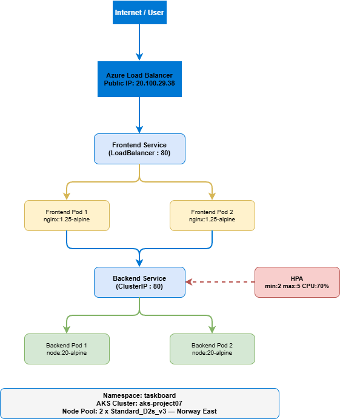

# Kubernetes Deployment on Azure AKS
**Expert of Experts Cloud + AI Master Plan — Project 07 | Fields 01 & 02**

## What I Built
A 2-tier application (Node.js REST API + Nginx frontend) deployed on Azure Kubernetes Service with automatic load balancing and auto-scaling.

## Architecture


## Live App
Deployed at: http://20.100.29.38

## Tech Stack
- Azure Kubernetes Service (AKS)
- kubectl
- YAML manifests
- Node.js (backend API)
- Nginx (frontend)
- Azure Load Balancer (public IP)
- Horizontal Pod Autoscaler (HPA)

## What Kubernetes Does Here
| Resource | What it does |
|---|---|
| Namespace | Isolates the app inside the cluster |
| Deployment | Keeps 2 Pods running always, auto-replaces if one crashes |
| Service (ClusterIP) | Internal DNS so frontend always finds the backend |
| Service (LoadBalancer) | Creates an Azure public IP automatically |
| ConfigMap | Stores HTML config outside the container image |
| HPA | Auto-scales backend Pods from 2→5 when CPU exceeds 70% |

## How to Deploy
```bash
az group create --name rg-project07-aks --location norwayeast
az aks create --resource-group rg-project07-aks --name aks-project07 --node-count 2 --node-vm-size Standard_D2s_v3 --generate-ssh-keys --location norwayeast
az aks get-credentials --resource-group rg-project07-aks --name aks-project07
kubectl apply -f k8s/
```

## What I Learned
- Kubernetes separates concerns cleanly — networking, scaling, and config are all independent
- The HPA watches CPU in real time and adds Pods automatically with no manual intervention
- Refreshing the app shows different Pod names in the footer — live load balancing across 2 containers
- ConfigMaps let you update app config without rebuilding Docker images